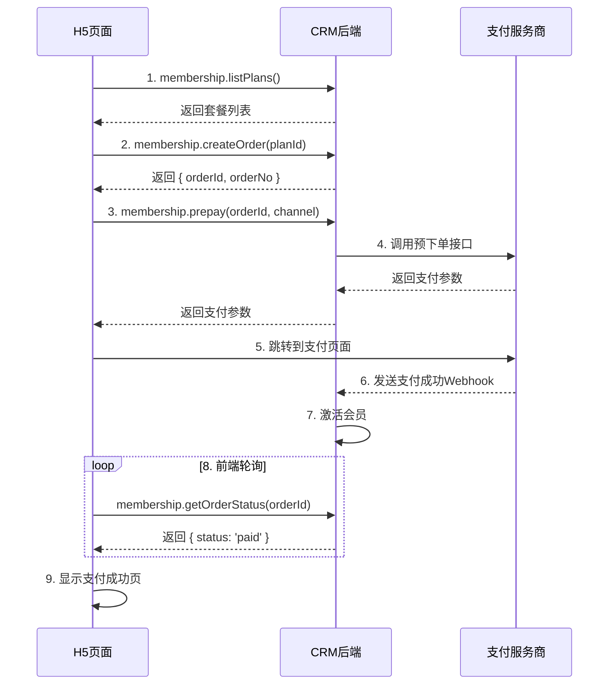

# 瀛姬App会员费H5页面后端需求文档

**版本**: 1.0  
**日期**: 2026-02-27  
**作者**: Manus AI

---

## 1. 概述

本文档定义瀛姬App会员费H5页面的后端接口需求，支持用户在H5页面中购买会员、查询会员状态、管理会员权益等功能。会员费支付采用与课程订单相同的支付架构，支持微信支付、支付宝和账户余额三种支付方式。

### 1.1. 业务目标

会员费H5页面旨在为用户提供便捷的会员购买和管理体验，核心业务目标包括：

- 用户可以在H5页面查看会员权益和价格
- 用户可以选择会员套餐并完成支付
- 用户可以查询当前会员状态和到期时间
- 系统自动处理会员激活、续费和过期逻辑
- 支持会员订单的退款和取消

### 1.2. 技术架构

会员费支付流程复用现有的支付架构，采用异步回调机制确保支付状态的最终一致性。H5页面通过tRPC接口与CRM后端通信，支付成功后通过Webhook回调更新会员状态。

---

## 2. 数据模型

### 2.1. 会员套餐表 (membership_plans)

会员套餐定义了不同的会员类型、价格和权益。

| 字段名 | 数据类型 | 说明 | 约束 |
| :--- | :--- | :--- | :--- |
| id | int | 套餐ID | 主键，自增 |
| name | string | 套餐名称 | 非空，例如"月度会员"、"年度会员" |
| description | text | 套餐描述 | 可选，详细介绍会员权益 |
| duration | int | 有效期（天数） | 非空，例如30、365 |
| price | decimal(10,2) | 价格（元） | 非空 |
| originalPrice | decimal(10,2) | 原价（元） | 可选，用于显示折扣 |
| benefits | json | 会员权益列表 | 可选，JSON数组格式 |
| isActive | boolean | 是否启用 | 默认true |
| sortOrder | int | 排序顺序 | 默认0，数字越小越靠前 |
| createdAt | datetime | 创建时间 | 自动生成 |
| updatedAt | datetime | 更新时间 | 自动更新 |

**示例数据**:
```json
{
  "id": 1,
  "name": "月度会员",
  "description": "享受30天会员权益",
  "duration": 30,
  "price": 99.00,
  "originalPrice": 129.00,
  "benefits": [
    "课程8折优惠",
    "优先预约老师",
    "专属客服支持",
    "会员专属活动"
  ],
  "isActive": true,
  "sortOrder": 1
}
```

### 2.2. 会员订单表 (membership_orders)

记录用户购买会员的订单信息。

| 字段名 | 数据类型 | 说明 | 约束 |
| :--- | :--- | :--- | :--- |
| id | int | 订单ID | 主键，自增 |
| orderNo | string | 订单号 | 唯一，格式: MEM{timestamp}{random} |
| userId | int | 用户ID | 外键，关联users表 |
| planId | int | 套餐ID | 外键，关联membership_plans表 |
| amount | decimal(10,2) | 支付金额 | 非空 |
| status | enum | 订单状态 | pending, paid, cancelled, refunded |
| paymentChannel | enum | 支付渠道 | wechat, alipay, balance |
| channelOrderNo | string | 支付渠道订单号 | 可选 |
| paymentDate | datetime | 支付时间 | 可选 |
| activatedAt | datetime | 激活时间 | 可选，支付成功后自动设置 |
| expiresAt | datetime | 到期时间 | 可选，激活时间 + 套餐有效期 |
| createdAt | datetime | 创建时间 | 自动生成 |
| updatedAt | datetime | 更新时间 | 自动更新 |

### 2.3. 用户表 (users) 扩展字段

在现有users表中添加会员相关字段。

| 字段名 | 数据类型 | 说明 | 约束 |
| :--- | :--- | :--- | :--- |
| membershipStatus | enum | 会员状态 | active, expired, pending, none |
| isMember | boolean | 是否为会员 | 默认false |
| membershipOrderId | int | 当前会员订单ID | 外键，关联membership_orders表 |
| membershipActivatedAt | datetime | 会员激活时间 | 可选 |
| membershipExpiresAt | datetime | 会员到期时间 | 可选 |

---

## 3. 接口定义

### 3.1. 查询会员套餐列表

**接口名称**: `membership.listPlans`

**请求参数**: 无

**响应数据**:
```typescript
{
  plans: Array<{
    id: number;
    name: string;
    description: string;
    duration: number;
    price: number;
    originalPrice: number;
    benefits: string[];
    isActive: boolean;
    sortOrder: number;
  }>;
}
```

**业务逻辑**:
- 查询所有启用状态的会员套餐
- 按sortOrder字段升序排序
- 返回套餐列表供H5页面展示

### 3.2. 查询当前用户会员状态

**接口名称**: `membership.getStatus`

**请求参数**: 无（从ctx.user获取当前用户）

**响应数据**:
```typescript
{
  isMember: boolean;
  membershipStatus: 'active' | 'expired' | 'pending' | 'none';
  activatedAt: string | null;
  expiresAt: string | null;
  daysRemaining: number | null;
  currentPlan: {
    id: number;
    name: string;
    benefits: string[];
  } | null;
}
```

**业务逻辑**:
- 查询当前用户的会员状态
- 计算剩余天数（expiresAt - 当前时间）
- 如果已过期，自动更新membershipStatus为expired
- 返回当前会员套餐信息

### 3.3. 创建会员订单

**接口名称**: `membership.createOrder`

**请求参数**:
```typescript
{
  planId: number;  // 套餐ID
}
```

**响应数据**:
```typescript
{
  orderId: number;
  orderNo: string;
  amount: number;
  planName: string;
}
```

**业务逻辑**:
- 验证planId是否有效且启用
- 生成唯一的订单号（格式: MEM{timestamp}{random}）
- 创建状态为pending的会员订单
- 返回订单信息供前端调用支付接口

### 3.4. 会员订单预下单

**接口名称**: `membership.prepay`

**请求参数**:
```typescript
{
  orderId: number;
  paymentChannel: 'wechat' | 'alipay' | 'balance';
}
```

**响应数据**:
```typescript
// 微信支付H5
{
  mwebUrl: string;  // 微信H5支付跳转URL
}

// 支付宝H5
{
  formHtml: string;  // 支付宝H5支付表单HTML
}

// 账户余额
{
  success: boolean;
}
```

**业务逻辑**:
- 验证orderId是否有效且状态为pending
- 根据paymentChannel调用对应的支付服务商预下单接口
- 微信支付H5: 调用统一下单接口，trade_type=MWEB
- 支付宝H5: 调用手机网站支付接口
- 账户余额: 执行内部扣款，成功后直接调用激活逻辑
- 返回前端拉起支付所需参数

### 3.5. 查询会员订单状态

**接口名称**: `membership.getOrderStatus`

**请求参数**:
```typescript
{
  orderId: number;
}
```

**响应数据**:
```typescript
{
  status: 'pending' | 'paid' | 'cancelled' | 'refunded';
  paymentDate: string | null;
  activatedAt: string | null;
  expiresAt: string | null;
}
```

**业务逻辑**:
- 查询指定订单的最新状态
- 供前端轮询使用，确认支付是否成功
- 返回订单状态和会员激活信息

### 3.6. 会员订单支付回调处理

**接口名称**: `/api/webhook/membership-payment-notify`

**请求参数**: 支付服务商回调数据（微信/支付宝格式）

**响应数据**: 按支付服务商要求返回成功响应

**业务逻辑**:
- 验证回调签名，确保来自可信的支付服务商
- 提取订单号和支付状态
- 幂等性检查：如果订单已是paid状态，直接返回成功
- 更新订单状态为paid，记录paymentDate和channelOrderNo
- **激活会员**:
  - 更新users表的membershipStatus为active
  - 设置isMember为true
  - 记录membershipOrderId
  - 计算并设置membershipActivatedAt（当前时间）
  - 计算并设置membershipExpiresAt（激活时间 + 套餐有效期）
- 更新订单的activatedAt和expiresAt字段
- 返回成功响应给支付服务商

### 3.7. 取消会员订单

**接口名称**: `membership.cancelOrder`

**请求参数**:
```typescript
{
  orderId: number;
}
```

**响应数据**:
```typescript
{
  success: boolean;
}
```

**业务逻辑**:
- 验证订单是否属于当前用户
- 验证订单状态是否为pending（只能取消未支付订单）
- 更新订单状态为cancelled
- 返回操作结果

### 3.8. 会员订单列表

**接口名称**: `membership.listOrders`

**请求参数**:
```typescript
{
  page?: number;      // 页码，默认1
  pageSize?: number;  // 每页数量，默认10
  status?: 'pending' | 'paid' | 'cancelled' | 'refunded';  // 可选，筛选状态
}
```

**响应数据**:
```typescript
{
  orders: Array<{
    id: number;
    orderNo: string;
    planName: string;
    amount: number;
    status: string;
    paymentChannel: string | null;
    paymentDate: string | null;
    activatedAt: string | null;
    expiresAt: string | null;
    createdAt: string;
  }>;
  total: number;
  page: number;
  pageSize: number;
}
```

**业务逻辑**:
- 查询当前用户的会员订单列表
- 支持按状态筛选
- 支持分页查询
- 按创建时间倒序排序

---

## 4. 业务流程

### 4.1. 会员购买流程



### 4.2. 会员激活逻辑

当会员订单支付成功后，系统自动执行以下激活逻辑：

1. 检查用户当前会员状态
   - 如果是首次购买（membershipStatus为none或expired）：直接激活
   - 如果已是会员（membershipStatus为active）：延长到期时间

2. 更新用户会员信息
   - membershipStatus设置为active
   - isMember设置为true
   - membershipOrderId设置为当前订单ID
   - membershipActivatedAt设置为当前时间（首次购买）或保持不变（续费）
   - membershipExpiresAt计算方式：
     - 首次购买：当前时间 + 套餐有效期
     - 续费：max(当前时间, 原到期时间) + 套餐有效期

3. 更新订单信息
   - activatedAt设置为当前时间
   - expiresAt设置为计算后的到期时间

### 4.3. 会员过期处理

系统需要定时任务（建议每天凌晨执行）检查会员到期情况：

1. 查询所有membershipStatus为active且membershipExpiresAt < 当前时间的用户
2. 批量更新这些用户的membershipStatus为expired，isMember为false
3. 可选：发送会员到期提醒通知

---

## 5. H5页面支付方式说明

### 5.1. 微信支付H5

微信支付H5适用于在微信外部浏览器（如Safari、Chrome）中打开的H5页面。

- **接口类型**: 统一下单接口，trade_type=MWEB
- **返回参数**: mweb_url（H5支付跳转URL）
- **前端处理**: 直接跳转到mweb_url
- **回调处理**: 用户支付完成后，微信会跳转到redirect_url，前端需要轮询订单状态

### 5.2. 支付宝H5

支付宝H5适用于所有移动端浏览器。

- **接口类型**: 手机网站支付接口（alipay.trade.wap.pay）
- **返回参数**: 完整的HTML表单
- **前端处理**: 将HTML表单插入页面并自动提交
- **回调处理**: 支付完成后跳转到return_url，前端需要轮询订单状态

### 5.3. 账户余额

使用用户账户余额直接扣款，无需跳转外部支付页面。

- **前端处理**: 调用prepay接口后直接返回成功
- **后端处理**: 同步执行扣款和激活逻辑
- **无需轮询**: 前端可直接显示支付成功

---

## 6. 数据库迁移SQL

### 6.1. 创建会员套餐表

```sql
CREATE TABLE membership_plans (
  id INT AUTO_INCREMENT PRIMARY KEY,
  name VARCHAR(100) NOT NULL COMMENT '套餐名称',
  description TEXT COMMENT '套餐描述',
  duration INT NOT NULL COMMENT '有效期（天数）',
  price DECIMAL(10,2) NOT NULL COMMENT '价格（元）',
  originalPrice DECIMAL(10,2) COMMENT '原价（元）',
  benefits JSON COMMENT '会员权益列表',
  isActive BOOLEAN DEFAULT TRUE COMMENT '是否启用',
  sortOrder INT DEFAULT 0 COMMENT '排序顺序',
  createdAt DATETIME DEFAULT CURRENT_TIMESTAMP,
  updatedAt DATETIME DEFAULT CURRENT_TIMESTAMP ON UPDATE CURRENT_TIMESTAMP,
  INDEX idx_isActive (isActive),
  INDEX idx_sortOrder (sortOrder)
) ENGINE=InnoDB DEFAULT CHARSET=utf8mb4 COMMENT='会员套餐表';
```

### 6.2. 创建会员订单表

```sql
CREATE TABLE membership_orders (
  id INT AUTO_INCREMENT PRIMARY KEY,
  orderNo VARCHAR(50) NOT NULL UNIQUE COMMENT '订单号',
  userId INT NOT NULL COMMENT '用户ID',
  planId INT NOT NULL COMMENT '套餐ID',
  amount DECIMAL(10,2) NOT NULL COMMENT '支付金额',
  status ENUM('pending', 'paid', 'cancelled', 'refunded') DEFAULT 'pending' COMMENT '订单状态',
  paymentChannel ENUM('wechat', 'alipay', 'balance') COMMENT '支付渠道',
  channelOrderNo VARCHAR(100) COMMENT '支付渠道订单号',
  paymentDate DATETIME COMMENT '支付时间',
  activatedAt DATETIME COMMENT '激活时间',
  expiresAt DATETIME COMMENT '到期时间',
  createdAt DATETIME DEFAULT CURRENT_TIMESTAMP,
  updatedAt DATETIME DEFAULT CURRENT_TIMESTAMP ON UPDATE CURRENT_TIMESTAMP,
  FOREIGN KEY (userId) REFERENCES users(id),
  FOREIGN KEY (planId) REFERENCES membership_plans(id),
  INDEX idx_userId (userId),
  INDEX idx_status (status),
  INDEX idx_orderNo (orderNo)
) ENGINE=InnoDB DEFAULT CHARSET=utf8mb4 COMMENT='会员订单表';
```

### 6.3. 扩展用户表字段

```sql
ALTER TABLE users
ADD COLUMN membershipStatus ENUM('active', 'expired', 'pending', 'none') DEFAULT 'none' COMMENT '会员状态',
ADD COLUMN isMember BOOLEAN DEFAULT FALSE COMMENT '是否为会员',
ADD COLUMN membershipOrderId INT COMMENT '当前会员订单ID',
ADD COLUMN membershipActivatedAt DATETIME COMMENT '会员激活时间',
ADD COLUMN membershipExpiresAt DATETIME COMMENT '会员到期时间',
ADD INDEX idx_membershipStatus (membershipStatus),
ADD INDEX idx_isMember (isMember),
ADD FOREIGN KEY (membershipOrderId) REFERENCES membership_orders(id);
```

### 6.4. 插入示例会员套餐数据

```sql
INSERT INTO membership_plans (name, description, duration, price, originalPrice, benefits, sortOrder) VALUES
('月度会员', '享受30天会员权益', 30, 99.00, 129.00, '["课程8折优惠", "优先预约老师", "专属客服支持", "会员专属活动"]', 1),
('季度会员', '享受90天会员权益', 90, 268.00, 387.00, '["课程8折优惠", "优先预约老师", "专属客服支持", "会员专属活动", "免费参加线下沙龙"]', 2),
('年度会员', '享受365天会员权益', 365, 888.00, 1548.00, '["课程7折优惠", "优先预约老师", "专属客服支持", "会员专属活动", "免费参加线下沙龙", "生日专属礼物"]', 3);
```

---

## 7. 安全与性能考虑

### 7.1. 安全措施

- **支付回调验签**: 严格校验支付服务商回调签名，防止伪造请求
- **幂等性处理**: 支付回调可能重复发送，必须保证重复处理不会产生副作用
- **权限控制**: 所有会员接口必须验证用户登录状态（使用protectedProcedure）
- **订单归属验证**: 查询和操作订单时，必须验证订单是否属于当前用户
- **金额校验**: 预下单时验证订单金额与套餐价格是否一致

### 7.2. 性能优化

- **数据库索引**: 在userId、status、orderNo等常用查询字段上建立索引
- **缓存策略**: 会员套餐列表可以缓存，减少数据库查询
- **定时任务**: 会员过期检查使用定时任务批量处理，避免实时查询影响性能
- **分页查询**: 订单列表查询必须支持分页，避免一次性加载大量数据

---

## 8. 开发优先级

### 8.1. 第一阶段（核心功能）

- [ ] 创建数据库表和字段
- [ ] 实现membership.listPlans接口
- [ ] 实现membership.getStatus接口
- [ ] 实现membership.createOrder接口
- [ ] 实现membership.prepay接口（支持账户余额）
- [ ] 实现支付回调处理和会员激活逻辑

### 8.2. 第二阶段（完善功能）

- [ ] 实现membership.getOrderStatus接口
- [ ] 实现membership.listOrders接口
- [ ] 实现membership.cancelOrder接口
- [ ] 实现会员过期定时任务
- [ ] 集成微信支付H5和支付宝H5

### 8.3. 第三阶段（优化和测试）

- [ ] 编写单元测试
- [ ] 性能优化和缓存策略
- [ ] 监控和日志记录
- [ ] 文档完善和交付

---

## 9. 附录

### 9.1. 会员状态枚举说明

| 状态值 | 说明 |
| :--- | :--- |
| none | 从未购买过会员 |
| pending | 有待支付的会员订单 |
| active | 会员有效期内 |
| expired | 会员已过期 |

### 9.2. 订单状态枚举说明

| 状态值 | 说明 |
| :--- | :--- |
| pending | 待支付 |
| paid | 已支付 |
| cancelled | 已取消 |
| refunded | 已退款 |

### 9.3. 支付渠道枚举说明

| 渠道值 | 说明 |
| :--- | :--- |
| wechat | 微信支付 |
| alipay | 支付宝 |
| balance | 账户余额 |

---

**文档结束**
