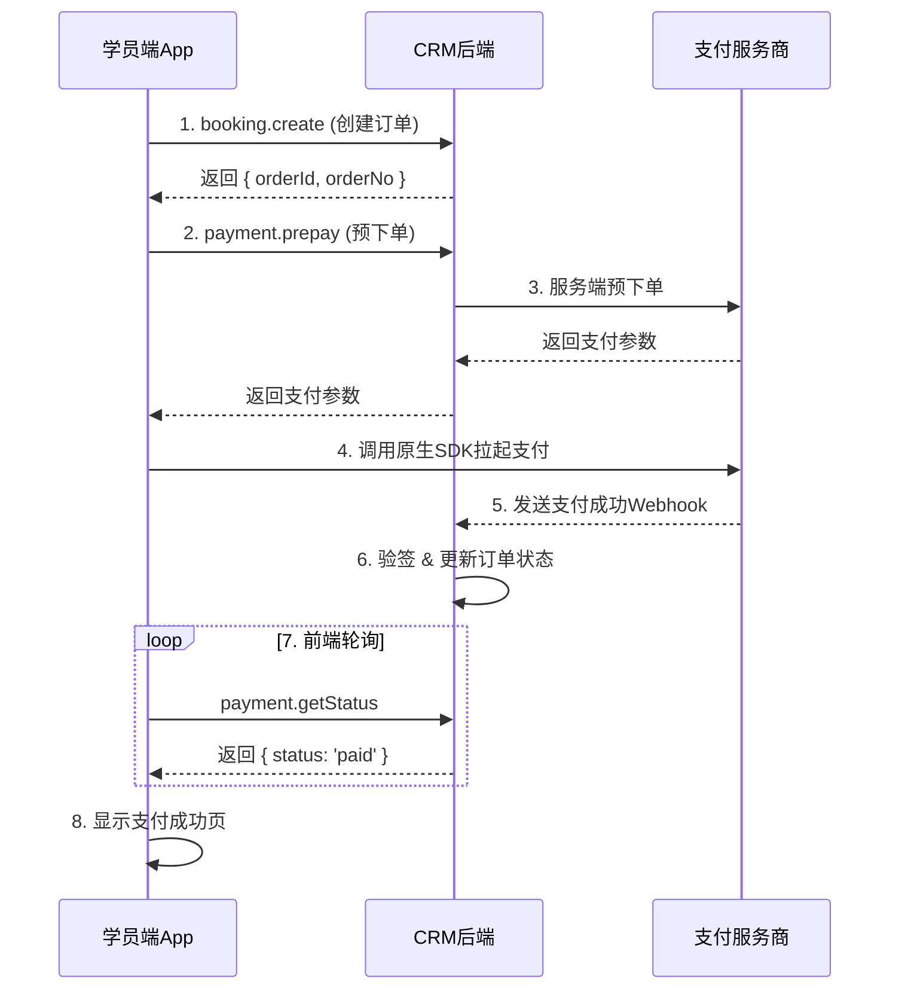

# 瀛姬App支付接口API文档

**版本**: 1.0  
**日期**: 2026-02-27  
**作者**: Manus AI

---

## 目录

1. [概述](#概述)
2. [接口基础信息](#接口基础信息)
3. [支付流程](#支付流程)
4. [核心接口](#核心接口)
   - [4.1 预下单接口](#41-预下单接口)
   - [4.2 查询订单状态](#42-查询订单状态)
   - [4.3 更新订单状态](#43-更新订单状态内部接口)
5. [Webhook回调接口](#webhook回调接口)
   - [5.1 微信支付回调](#51-微信支付回调)
   - [5.2 支付宝回调](#52-支付宝回调)
6. [订单管理接口](#订单管理接口)
   - [6.1 创建订单](#61-创建订单)
7. [错误码说明](#错误码说明)
8. [前端集成指南](#前端集成指南)
9. [环境变量配置](#环境变量配置)
10. [安全注意事项](#安全注意事项)

---

## 概述

本文档描述了瀛姬App的支付接口系统，支持**微信支付**、**支付宝**和**账户余额支付**三种支付方式。系统采用异步回调机制，确保订单支付状态的最终一致性和数据安全性。

**核心原则**：订单支付状态的唯一可信来源是支付服务商（微信/支付宝）的服务端回调（Webhook），而非前端App的返回结果。

---

## 接口基础信息

### 基础URL

- **生产环境**: `https://crm.bdsm.com.cn`
- **开发环境**: `http://localhost:3000`

### 协议

所有接口使用**tRPC**协议，通过HTTP POST请求访问`/api/trpc`端点。

### 认证方式

- **用户认证**: 使用Session Cookie（通过OAuth登录获取）
- **Webhook认证**: 使用签名验证（详见Webhook章节）

### 数据格式

- **请求格式**: JSON
- **响应格式**: JSON
- **字符编码**: UTF-8

---

## 支付流程

### 完整支付流程图



### 流程说明

1. **创建订单**: App调用`booking.create`创建待支付订单，获取`orderId`和`orderNo`
2. **预下单**: App调用`payment.prepay`获取支付参数
3. **拉起支付**: App使用原生SDK拉起支付界面
4. **支付回调**: 支付服务商发送Webhook通知到CRM后端
5. **更新状态**: CRM后端验签并更新订单状态
6. **轮询确认**: App轮询`payment.getStatus`确认支付成功
7. **显示结果**: App显示支付成功页面

---

## 核心接口

### 4.1 预下单接口

**接口名称**: `payment.prepay`

**接口描述**: 向支付服务商进行预下单，获取前端拉起原生支付所需的参数。

**请求方法**: `mutation`

**是否需要认证**: 是

#### 请求参数

| 参数名 | 类型 | 必填 | 说明 |
|--------|------|------|------|
| orderId | number | 是 | 订单ID |
| paymentChannel | string | 是 | 支付渠道：`wechat`（微信支付）、`alipay`（支付宝）、`balance`（账户余额） |

#### 请求示例

```typescript
const result = await trpc.payment.prepay.mutate({
  orderId: 12345,
  paymentChannel: "wechat"
});
```

#### 响应参数

**微信支付响应**:

| 参数名 | 类型 | 说明 |
|--------|------|------|
| partnerId | string | 微信商户号 |
| prepayId | string | 预支付交易会话ID |
| nonceStr | string | 随机字符串 |
| timestamp | string | 时间戳 |
| sign | string | 签名 |
| package | string | 固定值"Sign=WXPay" |

**支付宝响应**:

| 参数名 | 类型 | 说明 |
|--------|------|------|
| orderString | string | 完整的订单字符串，用于调起支付宝SDK |

**账户余额响应**:

| 参数名 | 类型 | 说明 |
|--------|------|------|
| success | boolean | 是否成功 |
| message | string | 结果消息 |

#### 响应示例

**微信支付**:
```json
{
  "partnerId": "1234567890",
  "prepayId": "wx20260227123456789",
  "nonceStr": "abc123",
  "timestamp": "1709012345",
  "sign": "ABCD1234...",
  "package": "Sign=WXPay"
}
```

**支付宝**:
```json
{
  "orderString": "alipay_sdk=alipay-sdk-java-4.38.0.ALL&app_id=2021..."
}
```

**账户余额**:
```json
{
  "success": true,
  "message": "余额支付成功"
}
```

#### 错误码

| 错误码 | 说明 |
|--------|------|
| NOT_FOUND | 订单不存在 |
| BAD_REQUEST | 订单状态不正确或支付渠道不支持 |
| INTERNAL_SERVER_ERROR | 数据库连接失败或支付服务商调用失败 |

---

### 4.2 查询订单状态

**接口名称**: `payment.getStatus`

**接口描述**: 查询订单的最新支付状态，供前端轮询使用。

**请求方法**: `query`

**是否需要认证**: 否

#### 请求参数

| 参数名 | 类型 | 必填 | 说明 |
|--------|------|------|------|
| orderId | number | 是 | 订单ID |

#### 请求示例

```typescript
const result = await trpc.payment.getStatus.query({
  orderId: 12345
});
```

#### 响应参数

| 参数名 | 类型 | 说明 |
|--------|------|------|
| status | string | 订单状态：`pending`（待支付）、`paid`（已支付）、`has_balance`（有余额）、`completed`（已完成）、`cancelled`（已取消）、`refunded`（已退款） |
| paymentDate | Date | 支付日期（可选） |
| paymentChannel | string | 支付渠道（可选） |

#### 响应示例

```json
{
  "status": "paid",
  "paymentDate": "2026-02-27",
  "paymentChannel": "wechat"
}
```

#### 错误码

| 错误码 | 说明 |
|--------|------|
| NOT_FOUND | 订单不存在 |
| INTERNAL_SERVER_ERROR | 数据库连接失败 |

---

### 4.3 更新订单状态（内部接口）

**接口名称**: `payment.updateStatus`

**接口描述**: 更新订单的支付状态，由支付回调Webhook内部调用。

**请求方法**: `mutation`

**是否需要认证**: 否（由Webhook调用）

#### 请求参数

| 参数名 | 类型 | 必填 | 说明 |
|--------|------|------|------|
| orderId | number | 是 | 订单ID |
| status | string | 是 | 订单状态 |
| paymentDate | string | 否 | 支付日期（ISO 8601格式） |
| paymentChannel | string | 否 | 支付渠道 |
| channelOrderNo | string | 否 | 支付渠道订单号 |

#### 请求示例

```typescript
const result = await trpc.payment.updateStatus.mutate({
  orderId: 12345,
  status: "paid",
  paymentDate: "2026-02-27T12:00:00Z",
  paymentChannel: "wechat",
  channelOrderNo: "wx20260227123456789"
});
```

#### 响应参数

| 参数名 | 类型 | 说明 |
|--------|------|------|
| success | boolean | 是否成功 |
| message | string | 结果消息 |

#### 响应示例

```json
{
  "success": true,
  "message": "订单状态更新成功"
}
```

#### 幂等性说明

该接口实现了幂等性处理：如果订单已经是`paid`状态，重复调用不会产生副作用，直接返回成功。

---

## Webhook回调接口

### 5.1 微信支付回调

**接口路径**: `POST /api/webhook/wechat-payment-notify`

**接口描述**: 接收微信支付的异步回调通知。

#### 请求参数

微信支付回调参数详见[微信支付官方文档](https://pay.weixin.qq.com/wiki/doc/api/app/app.php?chapter=9_7&index=3)。

主要参数：

| 参数名 | 类型 | 说明 |
|--------|------|------|
| out_trade_no | string | 商户订单号（对应orderNo） |
| transaction_id | string | 微信支付订单号 |
| trade_state | string | 交易状态：SUCCESS（支付成功） |
| signature | string | 签名 |
| timestamp | string | 时间戳 |
| nonce | string | 随机字符串 |

#### 响应格式

成功响应：
```
SUCCESS
```

失败响应：
```
FAIL
```

#### 验签说明

微信支付回调必须进行签名验证，验证步骤：

1. 将回调参数按字典序排序
2. 拼接成字符串并加上API密钥
3. MD5加密并转大写
4. 与回调中的signature比对

**环境变量**：
- `WECHAT_API_KEY`: 微信API密钥

---

### 5.2 支付宝回调

**接口路径**: `POST /api/webhook/alipay-payment-notify`

**接口描述**: 接收支付宝的异步回调通知。

#### 请求参数

支付宝回调参数详见[支付宝官方文档](https://opendocs.alipay.com/open/204/105301)。

主要参数：

| 参数名 | 类型 | 说明 |
|--------|------|------|
| out_trade_no | string | 商户订单号（对应orderNo） |
| trade_no | string | 支付宝交易号 |
| trade_status | string | 交易状态：TRADE_SUCCESS（支付成功）、TRADE_FINISHED（交易完成） |
| sign | string | 签名 |
| sign_type | string | 签名类型 |

#### 响应格式

成功响应：
```
success
```

失败响应：
```
failure
```

#### 验签说明

支付宝回调必须进行签名验证，验证步骤：

1. 将回调参数按字典序排序（排除sign和sign_type）
2. 拼接成字符串
3. 使用支付宝公钥验证签名

**环境变量**：
- `ALIPAY_PUBLIC_KEY`: 支付宝公钥

---

## 订单管理接口

### 6.1 创建订单

**接口名称**: `booking.create`

**接口描述**: 创建一个待支付状态的订单。

**请求方法**: `mutation`

**是否需要认证**: 是

#### 请求参数

| 参数名 | 类型 | 必填 | 说明 |
|--------|------|------|------|
| cityId | number | 是 | 城市ID |
| teacherId | number | 是 | 老师ID |
| courseItems | array | 是 | 课程项目列表 |
| classDate | string | 是 | 上课日期 |
| classTime | string | 是 | 上课时间 |

#### 响应参数

| 参数名 | 类型 | 说明 |
|--------|------|------|
| orderId | number | 订单ID |
| orderNo | string | 订单号 |
| status | string | 订单状态（固定为"pending"） |

#### 响应示例

```json
{
  "orderId": 12345,
  "orderNo": "ORD20260227001",
  "status": "pending"
}
```

---

## 错误码说明

### tRPC错误码

| 错误码 | HTTP状态码 | 说明 |
|--------|-----------|------|
| BAD_REQUEST | 400 | 请求参数错误 |
| UNAUTHORIZED | 401 | 未认证 |
| FORBIDDEN | 403 | 无权限 |
| NOT_FOUND | 404 | 资源不存在 |
| INTERNAL_SERVER_ERROR | 500 | 服务器内部错误 |

### 业务错误码

| 错误消息 | 说明 | 解决方案 |
|---------|------|---------|
| "订单不存在" | orderId无效 | 检查orderId是否正确 |
| "订单状态不正确" | 订单不是pending状态 | 检查订单状态，已支付订单不能重复支付 |
| "不支持的支付渠道" | paymentChannel参数错误 | 使用wechat、alipay或balance |
| "数据库连接失败" | 数据库服务异常 | 联系技术支持 |

---

## 前端集成指南

### React Native集成步骤

#### 1. 安装支付SDK

**微信支付**:
```bash
npm install react-native-wechat-lib
```

**支付宝**:
```bash
npm install @ant-design/react-native
```

#### 2. 完整支付流程代码示例

```typescript
import { trpc } from './lib/trpc';
import * as WeChat from 'react-native-wechat-lib';

async function handlePayment(orderId: number, paymentChannel: 'wechat' | 'alipay' | 'balance') {
  try {
    // 1. 调用预下单接口
    const prepayResult = await trpc.payment.prepay.mutate({
      orderId,
      paymentChannel
    });

    // 2. 根据支付渠道拉起支付
    if (paymentChannel === 'wechat') {
      // 微信支付
      await WeChat.pay({
        partnerId: prepayResult.partnerId,
        prepayId: prepayResult.prepayId,
        nonceStr: prepayResult.nonceStr,
        timeStamp: prepayResult.timestamp,
        package: prepayResult.package,
        sign: prepayResult.sign
      });
    } else if (paymentChannel === 'alipay') {
      // 支付宝
      // TODO: 调用支付宝SDK
    } else if (paymentChannel === 'balance') {
      // 账户余额支付直接成功
      console.log('余额支付成功');
      return;
    }

    // 3. 轮询订单状态
    const maxAttempts = 30; // 最多轮询30次
    const interval = 2000; // 每2秒轮询一次

    for (let i = 0; i < maxAttempts; i++) {
      await new Promise(resolve => setTimeout(resolve, interval));

      const statusResult = await trpc.payment.getStatus.query({ orderId });

      if (statusResult.status === 'paid') {
        console.log('支付成功！');
        // 跳转到支付成功页面
        navigation.navigate('PaymentSuccess');
        return;
      }
    }

    // 轮询超时
    console.warn('支付状态确认超时');
    // 提示用户稍后查看订单状态

  } catch (error) {
    console.error('支付失败:', error);
    // 显示错误提示
  }
}
```

#### 3. 轮询策略建议

- **轮询间隔**: 2-3秒
- **最大次数**: 30次（约1分钟）
- **超时处理**: 提示用户稍后在"我的订单"中查看支付状态

---

## 环境变量配置

### 必需的环境变量

#### 微信支付

```bash
# 微信开放平台AppID
WECHAT_APP_ID=wx1234567890abcdef

# 微信商户号
WECHAT_MCH_ID=1234567890

# 微信API密钥
WECHAT_API_KEY=abcdef1234567890abcdef1234567890

# 微信支付回调URL
WECHAT_NOTIFY_URL=https://crm.bdsm.com.cn/api/webhook/wechat-payment-notify
```

#### 支付宝

```bash
# 支付宝AppID
ALIPAY_APP_ID=2021001234567890

# 应用私钥
ALIPAY_PRIVATE_KEY=MIIEvQIBADANBgkqhkiG9w0BAQEFAASC...

# 支付宝公钥
ALIPAY_PUBLIC_KEY=MIIBIjANBgkqhkiG9w0BAQEFAAOCAQ8A...

# 支付宝回调URL
ALIPAY_NOTIFY_URL=https://crm.bdsm.com.cn/api/webhook/alipay-payment-notify
```

### 配置说明

1. **微信支付资质申请**: 在[微信开放平台](https://open.weixin.qq.com/)申请移动应用支付功能
2. **支付宝资质申请**: 在[支付宝开放平台](https://open.alipay.com/)申请移动支付产品
3. **回调URL配置**: 在支付服务商后台配置回调URL，确保可以公网访问

---

## 安全注意事项

### 1. Webhook验签

**重要性**: 防止伪造的支付回调攻击。

**实现要点**:
- 必须严格验证回调签名
- 开发环境可以跳过验签（仅用于测试）
- 生产环境必须启用验签

### 2. 幂等性处理

**重要性**: 支付回调可能重复发送，必须保证幂等性。

**实现要点**:
- 检查订单状态，已支付订单不重复处理
- 使用数据库事务确保原子性
- 记录回调日志用于审计

### 3. HTTPS通信

**重要性**: 保护支付数据传输安全。

**实现要点**:
- 生产环境必须使用HTTPS
- 配置有效的SSL证书
- 禁用不安全的TLS版本

### 4. 敏感信息保护

**重要性**: 防止API密钥泄露。

**实现要点**:
- 使用环境变量存储密钥
- 不要将密钥提交到代码仓库
- 定期轮换API密钥

### 5. 订单金额校验

**重要性**: 防止金额篡改。

**实现要点**:
- 在预下单时校验订单金额
- 在回调时再次校验金额
- 记录金额变更日志

---

## 附录

### A. 订单状态流转图

```
pending (待支付)
    ↓
   paid (已支付)
    ↓
completed (已完成)
```

可能的异常流转：
```
pending → cancelled (取消)
paid → refunded (退款)
```

### B. 支付渠道对比

| 特性 | 微信支付 | 支付宝 | 账户余额 |
|------|---------|--------|---------|
| 手续费 | 0.6% | 0.6% | 0% |
| 到账时间 | T+1 | T+1 | 即时 |
| 用户体验 | 需要微信App | 需要支付宝App | 最快 |
| 适用场景 | 微信用户 | 支付宝用户 | 会员用户 |

### C. 常见问题FAQ

**Q1: 支付成功但订单状态未更新怎么办？**

A: 可能是Webhook回调延迟或失败。建议：
1. 等待1-2分钟后刷新订单状态
2. 检查Webhook日志确认是否收到回调
3. 联系技术支持手动核实

**Q2: 如何测试支付功能？**

A: 建议使用沙箱环境：
1. 微信支付提供[沙箱环境](https://pay.weixin.qq.com/wiki/doc/api/app/app.php?chapter=23_1)
2. 支付宝提供[沙箱环境](https://opendocs.alipay.com/open/200/105311)
3. 账户余额支付可以直接测试

**Q3: 支付回调超时怎么办？**

A: 支付服务商会重试回调（通常15分钟内多次重试）。如果长时间未收到回调：
1. 检查回调URL是否可以公网访问
2. 检查服务器防火墙配置
3. 查看服务器日志是否有错误

---

## 更新日志

### v1.0 (2026-02-27)

- 初始版本发布
- 实现微信支付、支付宝和账户余额支付
- 实现Webhook回调机制
- 完成API文档编写

---

**文档维护**: 本文档由Manus AI生成和维护，如有疑问请联系技术支持。
